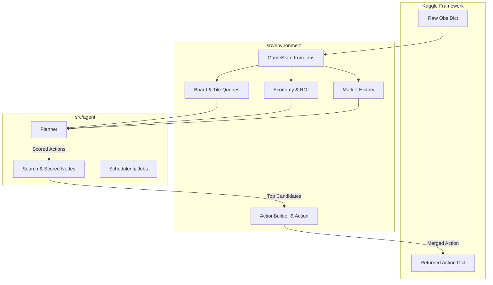

# Explanation: System Architecture

This document explains the architectural principles, module boundaries, and design trade-offs of the Jeremy Kaggriculture system.

---

## Architectural Principles

The codebase is built on four core design tenets:

1. **Strict Decoupling of State and Heuristics**: The environment representation ([`src/environment`](file:///d:/Projects/jeremy/src/environment)) knows nothing about agent strategies; it solely provides typed accessors, generators, and action factory builders.
2. **Prioritized Action Composition**: Decisions are not hardcoded into rigid `if-else` trees. Instead, independent evaluators push weighted candidates into a priority candidate pool ([`src/agent/search.py`](file:///d:/Projects/jeremy/src/agent/search.py)), which merges non-conflicting multi-unit and market orders.
3. **Reproducible Local Simulation**: The evaluation harness ([`src/simulation`](file:///d:/Projects/jeremy/src/simulation)) wraps `kaggle-environments` with automated seat rotation, progress tracking, and serialization.
4. **Self-Contained Submissions**: The submission builder ([`src/utils/build.py`](file:///d:/Projects/jeremy/src/utils/build.py)) packs only the necessary runtime files, keeping the submission bundle lightweight and free of local development artifacts.

---

## Subsystem Architecture Diagram

---

## Component Responsibilities

### 1. The Environment Abstraction Layer (`src/environment`)
* **`GameState`**: Converts Kaggle's nested dictionary observations into a typed, slot-optimized data structure. Prevents runtime key errors and redundant dictionary traversals.
* **`Board` and `Tile`**: Provides generator-based grid filtering (`plants()`, `empty_tiles()`, `harvestable()`, `needs_water()`) and distance calculations without materializing unnecessary intermediate lists.
* **`Economy`**: Centralizes crop parameter tables, seed prices, and ROI calculations (`crop_profit / grow_days`).
* **`ActionBuilder`**: Enforces correct payload syntax for all 18 discrete engine actions, providing `merge()` to combine concurrent farmer moves, hand dispatches, and market orders.

### 2. The Decision Layer (`src/agent`)
* **`Planner`**: Coordinates turn evaluation. It divides decision-making into independent phases (`evaluate_market`, `evaluate_current_tile`, `evaluate_planting`, `evaluate_movement`), enabling modular development and tuning.
* **`Search`**: A prioritized candidate pool. Rather than committing immediately to the first valid action, the planner registers multiple potential actions with numerical utility weights.
* **`Scheduler`**: An extensible priority job queue for assigning non-overlapping tasks across the farmer and multiple hired hands.

### 3. Simulation & Benchmarking (`src/simulation`, `src/utils`)
* **`Episode`**: Wraps the Kaggle execution engine, executing 720-step matches between any two agents. It guarantees exact reward extraction, error status detection, and replay persistence.
* **`utils.progress` & `utils.plot`**: Provide real-time CLI terminal progress indicators and matplotlib distributions for iterative evaluation loops.

### 4. Archive & Data Engineering (`src/archive`)
* Operates as an independent analytical subsystem for crawling, compressing, and extracting features from thousands of public Kaggle matches.
