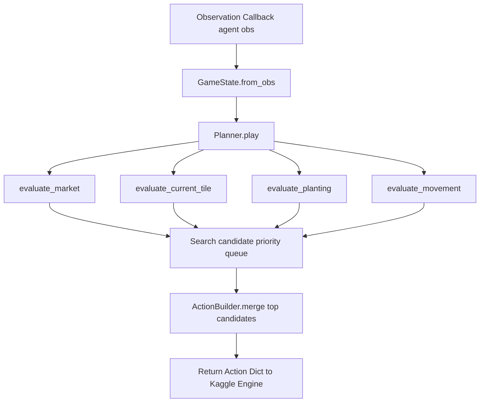

# How-To: Implement Agent Heuristics

This guide explains how to add and customize decision-making heuristics in the agent planner using the search queue, board queries, and action builders.

---

## The Decision Pipeline

The agent follows a 4-phase evaluation pipeline on each turn:



---

## Step 1: Querying the Farm with `Board` and `Tile`

Inside [`src/agent/planner.py`](file:///d:/Projects/jeremy/src/agent/planner.py), [`environment.board.Board`](file:///d:/Projects/jeremy/src/environment/board.py) wraps the grid into generator queries and Manhattan distance helpers:

```python
# Check if current tile has an unwatered crop
tile = self.state.current_tile
if isinstance(tile, dict) and tile.get("kind") == "PLANT":
    if not tile.get("watered_today"):
        self.add(80, ActionBuilder.water())

# Find the closest harvestable plant across the entire unlocked farm
closest_harvest = self.board.nearest(self.board.harvestable())
if closest_harvest:
    move_action = self.move_to(closest_harvest)
    self.add(40, move_action)
```

---

## Step 2: Adding Economic Decisions with `Economy`

Use [`environment.economy.Economy`](file:///d:/Projects/jeremy/src/environment/economy.py) to check crop ROI, seed affordability, and shed inventory:

```python
def evaluate_market(self) -> None:
    best_crop = self.eco.best_crop()
    if best_crop is None:
        return

    # Sell harvested inventory when market price exceeds seed cost
    if self.eco.should_sell(best_crop):
        inv_count = self.eco.inventory(best_crop)
        self.add(50, ActionBuilder.sell(best_crop, inv_count))

    # Buy seeds if we don't hold any and have enough money
    if self.eco.should_buy_seed(best_crop):
        self.add(40, ActionBuilder.buy_seed(best_crop, amount=1))
```

---

## Step 3: Example — Adding a Weed Clearing Heuristic

To clear weeds that spontaneously spawn on empty tiles, add a weed detection rule to `evaluate_current_tile` or `evaluate_movement`:

```python
def evaluate_weed_clearing(self) -> None:
    # Check if standing on a weed
    tile_data = self.state.current_tile
    if isinstance(tile_data, dict) and tile_data.get("kind") == "WEED":
        # Clearing an active obstacle takes precedence over idle movement
        self.add(90, ActionBuilder.dig())
        return

    # Find the nearest weed on the map and move towards it if no crops need urgent watering
    weeds = [t for t in self.board.all_tiles() if isinstance(t.data, dict) and t.data.get("kind") == "WEED"]
    nearest_weed = self.board.nearest(weeds)
    if nearest_weed:
        self.add(15, self.move_to(nearest_weed))
```

Then register the new method inside `Planner.play()`:

```python
def play(self) -> Action:
    self.evaluate_market()
    self.evaluate_current_tile()
    self.evaluate_planting()
    self.evaluate_weed_clearing()  # <-- New evaluation registered
    self.evaluate_movement()

    return self.choose()
```

---

## Step 4: Scoring Priority Calibration

Candidates are ranked by `score` in [`agent.search.Search`](file:///d:/Projects/jeremy/src/agent/search.py). When scoring actions, adhere to this calibration hierarchy:

| Action Type | Typical Score Range | Rationale |
| :--- | :--- | :--- |
| **Harvest Peak Crop** | `100 + (units * price)` | Realizing immediate revenue takes top precedence. |
| **Dig Weed Underfoot** | `90` | Frees up productive tile immediately. |
| **Water Thirsty Crop** | `80` | Prevents plant decay and ensures yield bonus. |
| **Plant Seed** | `60 + ROI` | Expands productive capacity on vacant tile. |
| **Sell Produce Order** | `50` | Concurrent market order; processed without blocking farmer move. |
| **Buy Seed Order** | `40` | Prepares inventory for next planting cycle. |
| **Move to Harvestable** | `40` | Closes distance to high-value harvest target. |
| **Move to Water Target** | `30` | Closes distance to unwatered crop. |
| **Move to Empty Tile** | `20` | Repositions farmer toward available soil. |

---

## Step 5: Validating Your Changes

Run a quick test episode to confirm your new heuristic executes without errors:

```bash
python -c "
from simulation.episode import Episode
ep = Episode(agent1='src/main.py', agent2='starter', debug=True)
result = ep.run()
print('Score:', result.score_challenger, 'Status:', result.status_challenger)
"
```
