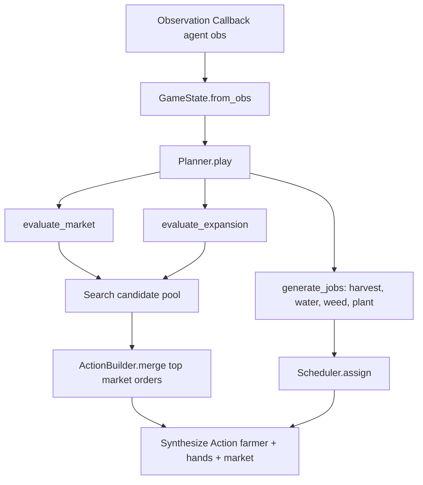

# How-To: Implement Agent Heuristics

This guide explains how to add and customize decision-making heuristics in the agent planner using the modular `src/agent/` pipeline, pure evaluators, candidate search pool, board queries, and action builders.

---

## The Decision Pipeline

The agent executes a pipeline of registered evaluators and task generators on each turn:



---

## Step 1: Defining a Custom Evaluator Function

Write a pure function taking explicit state models. Use score constants from [`agent.scores`](file:///c:/Users/Luke%20Enness/Projects/jeremy/src/agent/scores.py) to avoid magic numbers.

```python
from agent.scores import DIG_WEED, MOVE_EMPTY
from environment.actions import Action, ActionBuilder
from environment.board import Board
from environment.state import GameState


def evaluate_weed_patrol(planner) -> None:
    """Clear weeds underfoot or seek out nearest weeds on farm."""
    tile = planner.state.current_tile
    if isinstance(tile, dict) and tile.get("kind") == "WEED":
        planner.add(DIG_WEED, ActionBuilder.dig())
        return

    # Move toward nearest weed if idle
    weeds = [
        t
        for t in planner.board.all_tiles()
        if isinstance(t.data, dict) and t.data.get("kind") == "WEED"
    ]
    if nearest_weed := planner.board.nearest(weeds):
        planner.add(MOVE_EMPTY - 5.0, move_to(planner, nearest_weed))
```

---

## Step 2: Calling from `Planner`

Call your custom heuristic directly inside `Planner.play()`:

```python
def play(self) -> Action:
    evaluate_market(self)
    evaluate_farming(self)
    evaluate_movement(self)
    evaluate_weed_patrol(self)
    evaluate_expansion(self)
    return self.choose()
```

---

## Step 4: Scoring Priority Calibration

Candidates are ranked by `score` in [`agent.search.Search`](file:///d:/Projects/jeremy/src/agent/search.py). When scoring actions, adhere to this calibration hierarchy:

| Action Type | Typical Score Range | Rationale |
| :--- | :--- | :--- |
| **Harvest Peak Crop** | `100 + (units * price)` | Realizing immediate revenue takes top precedence. |
| **Dig Weed Underfoot** | `90` | Frees up productive tile immediately. |
| **Water Thirsty Crop** | `80` | Prevents plant decay and ensures yield bonus. |
| **Plant Seed** | `60 + ROI` | Expands productive capacity on vacant tile. |
| **Sell Produce Order** | `50` | Concurrent market order; processed without blocking farmer move. |
| **Buy Seed Order** | `40` | Prepares inventory for next planting cycle. |
| **Move to Harvestable** | `40` | Closes distance to high-value harvest target. |
| **Move to Water Target** | `30` | Closes distance to unwatered crop. |
| **Move to Empty Tile** | `20` | Repositions farmer toward available soil. |

---

## Step 5: Validating Your Changes

Run a quick test episode to confirm your new heuristic executes without errors:

```bash
python -c "
from simulation.episode import Episode
ep = Episode(agent1='src/main.py', agent2='starter', debug=True)
result = ep.run()
print('Score:', result.score_challenger, 'Status:', result.status_challenger)
"
```
