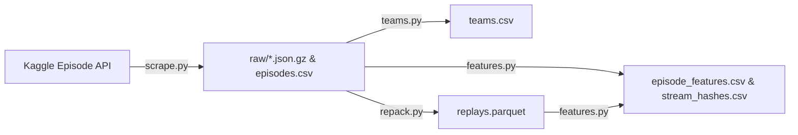

# How-To: Scrape & Process Ladder Replays

This guide walks through scraping public competitive matches from the Kaggle leaderboard, packing them into high-compression Parquet datasets, and extracting behavioral feature tables for imitation learning or meta-analysis.

---

## Overview of the Archive Pipeline



---

## Step 1: Crawl Match Replays (`scrape.py`)

The crawler queries Kaggle's public `EpisodeService/ListEpisodes` endpoint starting from seed top-ladder submission IDs, incrementally discovering opponent IDs:

```bash
cd src/archive
python scrape.py --max-new 50
```

### CLI Arguments
* `--max-new N`: Maximum number of new episodes to download in this batch. Defaults to polite rate-limiting (~1 request/second).

### Outputs
* `raw/{episode_id}.json.gz`: Gzipped raw replay JSONs from Kaggle CDN.
* `episodes.csv`: Episode metadata (timestamps, seat submission IDs, final coin balances, post-match skill ratings).
* `agents.csv`: Per-agent match results table.
* `state.json`: Crawler checkpoint state.

---

## Step 2: Update Team Metadata (`teams.py`)

Fetch the current leaderboard snapshot to map `team_id` integer keys to human-readable team names:

```bash
python teams.py
```

### Output
* `teams.csv`: Mapping table with columns `team_id,team_name,ladder_score,last_submission`.

---

## Step 3: Repack Replays into Zstandard Parquet (`repack.py`)

Raw replay JSONs can consume hundreds of megabytes. `repack.py` compresses all raw replays into a single Zstandard Parquet archive achieving ~230x compression ratio:

```bash
python repack.py
```

### Output
* `replays.parquet`: Single consolidated dataset with columns `episode_id` (int64) and `replay_json` (string).

---

## Step 4: Extract Behavioral Features (`features.py`)

Parse replay event streams to compute strategic indicators per player:

```bash
python features.py
```

### Extracted Features in `episode_features.csv`
* `peak_crew`: Maximum simultaneous farmhands active in a single day.
* `total_hires`: Cumulative farmhand hire orders successfully executed.
* `first_land_day`: In-game day when the first quadrant expansion (`BUY_LAND`) was bought.
* `tiles_planted`: Total crop planting actions across the season.
* `plants_<crop>`: Total plantings broken down by crop type (`WHEAT`, `CARROT`, `TOMATO`, `STRAWBERRY`, `MELON`).
* `price_<item>_min` / `price_<item>_max`: Market price volatility bounds observed during the match.
* `stream_hashes.csv`: SHA-256 action hash checkpoints at turns 24, 100, 200, 400, and 719 to detect identical strategy openings.

---

## Step 5: Querying Extracted Replays in Python

Query specific episodes from the packed Parquet dataset using PyArrow:

```python
import json
import pyarrow.dataset as pads
import pandas as pd

# Load top features
features_df = pd.read_csv("src/archive/episode_features.csv")
top_episodes = features_df.sort_values(by="final_money", ascending=False)
sample_id = int(top_episodes.iloc[0]["episode_id"])

# Query Parquet stream without loading entire file into memory
dataset = pads.dataset("src/archive/replays.parquet", format="parquet")
scanner = dataset.scanner(filter=pads.field("episode_id") == sample_id, batch_size=1)
raw_json = scanner.head(1).column("replay_json")[0].as_py()
replay_data = json.loads(raw_json)

print(f"Loaded Replay {sample_id} containing {len(replay_data['steps'])} turns.")
```
